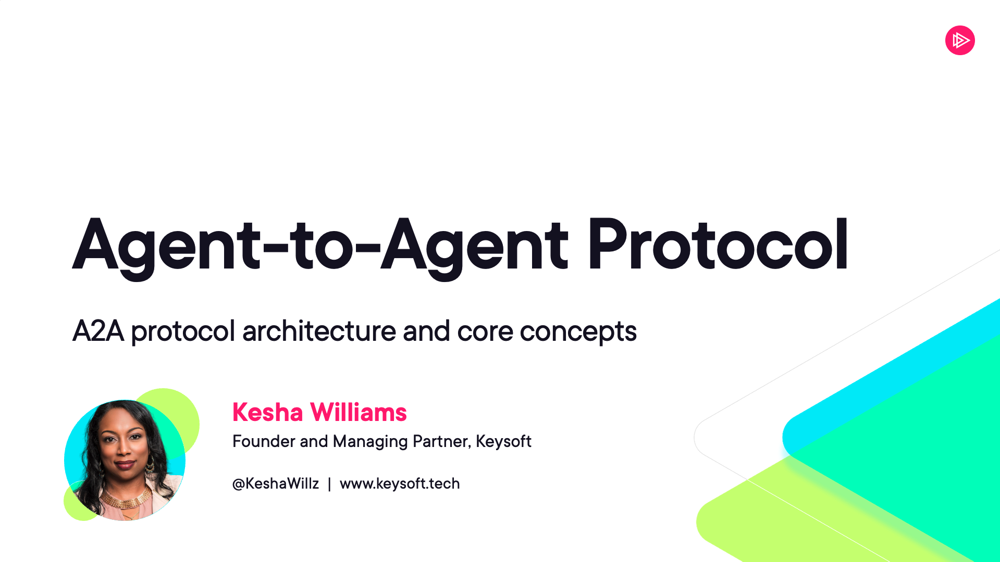

# Pluralsight: Agent-to-Agent Protocol - Course Code

This code is for the Pluralsight Agent-to-Agent Protocol course by Kesha Williams.


---

## Module 1: A2A Protocol Architecture and Core Concepts

A single demo agent that simulates a contract review workflow. No LLM or API keys required. 

### Files

```
clip-2-exploring-agent-cards-and-capability-discovery/
  __main__.py          # A2A server: agent card with AgentInterface, skill, server setup
  agent_executor.py    # Agent logic + AgentExecutor with full task lifecycle
  test_client.py       # Client using protobuf types from a2a.types.a2a_pb2
  requirements.txt     # Dependencies
```

### Setup (GitHub Codespaces)

```bash
cd clip-2-exploring-agent-cards-and-capability-discovery
python -m venv .venv
source .venv/bin/activate
pip install -r ../../requirements.txt
```

No `.env` file needed. No API keys.

### Running the Demo

**Terminal 1 - Start the agent server:**
```bash
python __main__.py
```

**Terminal 2 - Fetch the agent card:**
```bash
curl -s http://localhost:9999/.well-known/agent-card.json | python -m json.tool
```

**Terminal 2 - Run the full test client:**
```bash
python test_client.py
```

The client fetches the agent card, sends a sample contract with five risk clauses, and prints the task lifecycle output (WORKING status, artifact with risk assessment, COMPLETED status).

## Module 2: Building A2A Agents Across Frameworks

Four agents total: three remote specialists and one Client Agent that routes to them.

```
User -> Client Agent (port 9996) -> A2A -> Triage Agent (port 9999)
                                        -> Contract Review Agent (port 9998)
                                        -> Compliance Checker Agent (port 9997)
```

| Agent | Role | Framework | Port |
|---|---|---|---|
| Document Triage | Remote Agent | OpenAI Agents SDK | 9999 |
| Contract Review | Remote Agent | LangGraph | 9998 |
| Compliance Checker | Remote Agent | CrewAI | 9997 |
| Document Processing Client | Client Agent | A2A SDK + OpenAI | 9996 |

### Files

```
Module2/
  triage_agent.py               # OpenAI Agents SDK: classification logic
  a2a_triage_agent.py           # A2A server for triage agent (port 9999)
  contract_review_graph.py      # LangGraph: two-node analysis graph
  a2a_contract_review_agent.py  # A2A server using langgraph-a2a-server (port 9998)
  a2a_compliance_agent.py       # CrewAI agent + A2A server (port 9997)
  a2a_client_agent.py           # Client Agent: discovers remotes, routes requests (port 9996)
  user.py                       # "User" role: sends requests to the Client Agent
  requirements.txt              # All dependencies
  .env.example                  # Template for API key
```

### Setup (GitHub Codespaces)

```bash
cd Module2
python -m venv .venv
source .venv/bin/activate
pip install -r requirements.txt
cp .env.example .env
# Edit .env and paste your OpenAI API key
```

### Running the Full System

Open five terminal tabs. In each, activate the venv first:

```bash
cd Module2 && source .venv/bin/activate
```

**Terminal 1 - Triage Agent (OpenAI Agents SDK):**
```bash
python a2a_triage_agent.py
```

**Terminal 2 - Contract Review Agent (LangGraph):**
```bash
python a2a_contract_review_agent.py
```

**Terminal 3 - Compliance Checker Agent (CrewAI):**
```bash
python a2a_compliance_agent.py
```

**Terminal 4 - Client Agent:**
```bash
python a2a_client_agent.py
```

You should see it discover all three remote agents at startup:
```
Starting A2A Client Agent
Discovering remote agents...
  Discovered: DocumentTriageAgent at http://localhost:9999
  Discovered: ContractReviewAgent at http://localhost:9998
  Discovered: ComplianceCheckerAgent at http://localhost:9997
Discovered 3 remote agent(s)
```

**Terminal 5 - Run as the user:**
```bash
python user.py
```

### Verifying Agent Cards

With the servers running, you can curl any agent card:

```bash
curl -s http://localhost:9999/.well-known/agent-card.json | python -m json.tool
curl -s http://localhost:9998/.well-known/agent-card.json | python -m json.tool
curl -s http://localhost:9997/.well-known/agent-card.json | python -m json.tool
curl -s http://localhost:9996/.well-known/agent-card.json | python -m json.tool
```

---

## Module 3: Orchestration Patterns and Multi-Agent Workflows

Evolves the Module 2 Client Agent into a full orchestrator with task decomposition, hierarchical delegation, and retry logic. Uses the same remote agents from Module 2.

```
User -> Orchestrator (port 9996) -> A2A -> Triage Agent (port 9999)
                                        -> Contract Review Agent (port 9998) -> A2A -> Compliance Agent (port 9997)
                                        -> Compliance Agent (port 9997)
```

### Files

```
Module3/
  a2a_orchestrator_agent.py              # Orchestrator with decomposition, aggregation, retries (port 9996)
  a2a_contract_review_hierarchical.py    # Contract review with hierarchical delegation (port 9998)
  user_orchestrator.py                   # User script with complex multi-agent requests
  requirements.txt                       # Dependencies (same as Module 2)
  .env.example                           # Template for API key
```

### Setup (GitHub Codespaces)

```bash
cd Module3
python -m venv .venv
source .venv/bin/activate
pip install -r requirements.txt
cp .env.example .env
# Edit .env and paste your OpenAI API key
```

### Running the Full System

Reuse the Module 2 triage agent (port 9999) and compliance agent (port 9997). Replace the contract review agent and Client Agent with Module 3 versions.

**Terminal 1 - Triage Agent (from Module 2):**
```bash
cd Module2 && source .venv/bin/activate
python a2a_triage_agent.py
```

**Terminal 2 - Compliance Checker Agent (from Module 2):**
```bash
cd Module2 && source .venv/bin/activate
python a2a_compliance_agent.py
```

**Terminal 3 - Contract Review Agent (hierarchical, Module 3):**
```bash
cd Module3 && source .venv/bin/activate
python a2a_contract_review_hierarchical.py
```

**Terminal 4 - Orchestrator Agent (Module 3):**
```bash
cd Module3 && source .venv/bin/activate
python a2a_orchestrator_agent.py
```

**Terminal 5 - Run as the user:**
```bash
cd Module3 && source .venv/bin/activate
python user_orchestrator.py
```

### Clip 3 Failure Demo

To simulate a failure for Clip 3:
1. Stop the compliance agent (kill Terminal 2)
2. Run `python user_orchestrator.py` and send request 3
3. The orchestrator retries three times, then returns partial results with a failure note
4. Restart the compliance agent and run the same request to show recovery

---

## Module 4: Security, Testing, and Production Deployment

Secures the agents with authentication and audit logging, tests with A2A Inspector and pytest, and deploys to production with Agent Stack.

### Files

```
Module4/
  a2a_triage_agent_secured.py   # Triage agent with bearer auth + audit logging (Clip 1)
  test_protocol.py              # Pytest tests for agent card + lifecycle (Clip 2)
  agent_stack_triage.py         # Triage agent wrapped with Agent Stack SDK (Clip 3)
  Dockerfile                    # Container for Agent Stack deployment (Clip 3)
  requirements.txt              # Dependencies for secured agent + tests
  requirements-agentstack.txt   # Dependencies for Agent Stack wrapper
  .env.example                  # Template for API key + bearer token
```

### Setup (GitHub Codespaces)

```bash
cd Module4
python -m venv .venv
source .venv/bin/activate
pip install -r requirements.txt
cp .env.example .env
# Edit .env and paste your OpenAI API key
```
### Running the Secured Agent 

The secured agent needs `triage_agent.py` from Module 2 in the same directory (or on the Python path).

```bash
# Copy the triage logic from Module 2
cp ../Module2/triage_agent.py .

# Start the secured agent
python a2a_triage_agent_secured.py
```

Test with curl (no token = rejected):
```bash
curl -s -X POST http://localhost:9999/ -H "Content-Type: application/json" -d '{}'
```

Test with curl (valid token = accepted):
```bash
curl -s http://localhost:9999/.well-known/agent-card.json | python -m json.tool
```

The agent card endpoint is public (no auth required). All other endpoints require the bearer token.

### Running the A2A Inspector 

```bash
git clone https://github.com/a2aproject/a2a-inspector.git
cd a2a-inspector
docker build -t a2a-inspector .
docker run -d --network host --name a2a-inspector a2a-inspector
```

In Codespaces, go to the **Ports** tab, find port 8080, and click the globe icon to open the Inspector in your browser. For the agent URL in the Inspector UI, copy the forwarded URL for port 9999 from the Ports tab (looks like `https://your-codespace-9999.app.github.dev/`). The `--network host` flag lets the Inspector reach agents on localhost when sending messages.

### Running the Tests 

With an agent running on port 9999:
```bash
pytest test_protocol.py -v
```

### Agent Stack Deployment 

If Agent Stack is installed:
```bash
agentstack add .
agentstack list
agentstack run document-triage "This is a vendor agreement with an SLA."
agentstack ui
```
