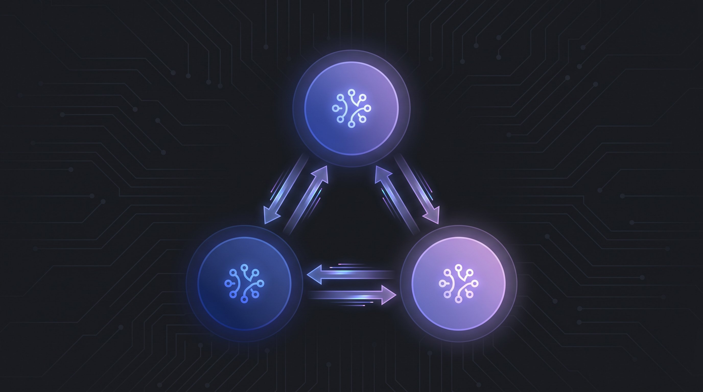

# A2A Multi-Agent System



[](https://vercel.com/new/clone?repository-url=https://github.com/OumaCavin/a2a-multi-agent-system)
[](https://github.com/OumaCavin/a2a-multi-agent-system/actions)

Build intelligent multi-agent systems using the Agent-to-Agent (A2A) protocol. This project demonstrates how to create, orchestrate, and deploy AI agents across multiple frameworks including OpenAI Agents SDK, LangGraph, and CrewAI.

---

## Table of Contents

- [Prerequisites](#prerequisites)
- [Clone and Setup](#clone-and-setup)
- [Quick Start](#quick-start)
- [Modules](#modules)
  - [Module 1: A2A Protocol Architecture](#module-1-a2a-protocol-architecture)
  - [Module 2: Building A2A Agents Across Frameworks](#module-2-building-a2a-agents-across-frameworks)
  - [Module 3: Orchestration Patterns](#module-3-orchestration-patterns)
  - [Module 4: Security and Deployment](#module-4-security-and-deployment)
- [Troubleshooting](#troubleshooting)
- [License](#license)

---

## Prerequisites

Before you begin, ensure you have the following installed:

| Requirement | Version | Notes |
|------------|---------|-------|
| Python | 3.11+ | Required for all modules |
| pip | Latest | For installing dependencies |
| Git | Any recent version | For cloning the repository |
| Docker | Optional | Only for A2A Inspector and Agent Stack |

### Required API Keys

- **OpenAI API Key**: Required for Modules 2, 3, and 4
  - Get yours at [OpenAI Platform](https://platform.openai.com/api-keys)

### Optional Tools

- **Docker**: For running A2A Inspector for testing and debugging
- **Agent Stack**: For production deployment (optional)

---

## Clone and Setup

### 1. Clone the Repository

```bash
git clone https://github.com/OumaCavin/a2a-multi-agent-system.git
cd a2a-multi-agent-system
```

### 2. Create Virtual Environment (Root Level)

For all modules, create a virtual environment at the root level:

```bash
# Create virtual environment
python -m venv .venv

# Activate it
source .venv/bin/activate  # On Windows: .venv\Scripts\activate

# Install dependencies
pip install -r requirements.txt
```

### 3. Set Up Environment Variables

For Modules 2, 3, and 4, you need an OpenAI API key:

```bash
# Copy environment template
cp Module2/.env.example Module2/.env

# Edit the .env file with your API key
# On Linux/Mac: use nano, vim, or any text editor
nano Module2/.env

# Same for other modules
cp Module3/.env.example Module3/.env
cp Module4/.env.example Module4/.env
```

Your `.env` file should look like:
```env
OPENAI_API_KEY=sk-your-actual-api-key-here
```

---

## Quick Start

### Module 1 (No API Key Required)

The fastest way to see A2A in action:

```bash
cd Module1/clip-2-exploring-agent-cards-and-capability-discovery

# Run the agent
python __main__.py

# In another terminal, test it
curl -s http://localhost:9999/.well-known/agent-card.json | python -m json.tool
python test_client.py
```

### Module 2 (Requires OpenAI API Key)

Run all four agents together:

```bash
# Terminal 1 - Start Triage Agent
python Module2/a2a_triage_agent.py

# Terminal 2 - Start Contract Review Agent
python Module2/a2a_contract_review_agent.py

# Terminal 3 - Start Compliance Checker Agent
python Module2/a2a_compliance_agent.py

# Terminal 4 - Start Client Agent
python Module2/a2a_client_agent.py

# Terminal 5 - Test the system
python Module2/user.py
```

---

## Modules

---

## Module 1: A2A Protocol Architecture

Learn the core concepts of the A2A protocol, including agent cards, capability discovery, and task lifecycle.

### No API Key Required

This module is completely self-contained and does not require any external API keys.

### Files

```
Module1/clip-2-exploring-agent-cards-and-capability-discovery/
  __main__.py          # A2A server with agent card and skills
  agent_executor.py    # Agent logic and task execution
  test_client.py       # Client for testing the agent
```

### Setup

```bash
cd Module1/clip-2-exploring-agent-cards-and-capability-discovery
pip install -r ../../requirements.txt
```

### Running the Demo

**Terminal 1 - Start the Agent:**
```bash
python __main__.py
```

You should see output similar to:
```
Starting A2A server on port 9999...
Visit http://localhost:9999/.well-known/agent-card.json to see agent capabilities
```

**Terminal 2 - Test the Agent:**
```bash
# Fetch the agent card
curl -s http://localhost:9999/.well-known/agent-card.json | python -m json.tool

# Run the test client
python test_client.py
```

Expected output:
```
Task created with ID: task_uuid_here
Task status: WORKING
Task status: COMPLETED
Task result:
- Risk Assessment: 5 risk clauses identified
- Overall Risk Level: HIGH
```

---

## Module 2: Building A2A Agents Across Frameworks

Build three specialized agents using different frameworks and connect them via the A2A protocol.

### Prerequisites

- OpenAI API key configured in `Module2/.env`

### Architecture

```
User -> Client Agent (port 9996)
           |
           +-> Triage Agent (port 9999)      [OpenAI Agents SDK]
           +-> Contract Review Agent (port 9998) [LangGraph]
           +-> Compliance Checker Agent (port 9997) [CrewAI]
```

### Files

```
Module2/
  a2a_triage_agent.py           # Document triage with OpenAI Agents SDK
  a2a_contract_review_agent.py  # Contract analysis with LangGraph
  a2a_compliance_agent.py       # Compliance checking with CrewAI
  a2a_client_agent.py           # Orchestrating client agent
  triage_agent.py               # Triage business logic
  user.py                       # User interaction script
  requirements.txt              # Module dependencies
  .env.example                  # Environment template
```

### Setup

```bash
# Navigate to module
cd Module2

# Create and activate virtual environment
python -m venv .venv
source .venv/bin/activate  # On Windows: .venv\Scripts\activate

# Install dependencies
pip install -r requirements.txt

# Configure environment
cp .env.example .env
# Edit .env and add your OPENAI_API_KEY
```

### Running the Full System

**Important**: Run each agent in a separate terminal.

```bash
# Activate virtual environment in each terminal
cd Module2 && source .venv/bin/activate
```

**Terminal 1 - Triage Agent:**
```bash
cd Module2
python a2a_triage_agent.py
```

**Terminal 2 - Contract Review Agent:**
```bash
cd Module2
python a2a_contract_review_agent.py
```

**Terminal 3 - Compliance Checker Agent:**
```bash
cd Module2
python a2a_compliance_agent.py
```

**Terminal 4 - Client Agent:**
```bash
cd Module2
python a2a_client_agent.py
```

You should see agent discovery output:
```
Starting A2A Client Agent
Discovering remote agents...
  Discovered: DocumentTriageAgent at http://localhost:9999
  Discovered: ContractReviewAgent at http://localhost:9998
  Discovered: ComplianceCheckerAgent at http://localhost:9997
Discovered 3 remote agent(s)
```

**Terminal 5 - User Interaction:**
```bash
cd Module2
python user.py
```

### Verifying All Agent Cards

```bash
curl -s http://localhost:9999/.well-known/agent-card.json | python -m json.tool
curl -s http://localhost:9998/.well-known/agent-card.json | python -m json.tool
curl -s http://localhost:9997/.well-known/agent-card.json | python -m json.tool
curl -s http://localhost:9996/.well-known/agent-card.json | python -m json.tool
```

---

## Module 3: Orchestration Patterns

Implement advanced orchestration patterns including task decomposition, hierarchical delegation, and failure handling.

### Prerequisites

- OpenAI API key configured in `Module3/.env`
- Triage Agent and Compliance Agent from Module 2

### Architecture

```
User -> Orchestrator (port 9996)
           |
           +-> Triage Agent (port 9999)      [Reuse from Module 2]
           +-> Contract Review Agent (port 9998) [Hierarchical delegation]
           |       |
           |       +-> Compliance Checker Agent (port 9997) [Sub-agent]
           +-> Compliance Checker Agent (port 9997) [Reuse from Module 2]
```

### Files

```
Module3/
  a2a_orchestrator_agent.py           # Main orchestrator with retry logic
  a2a_contract_review_hierarchical.py # Contract review with sub-delegation
  user_orchestrator.py                # User interaction for orchestration
  requirements.txt                   # Module dependencies
  .env.example                       # Environment template
```

### Setup

```bash
cd Module3
python -m venv .venv
source .venv/bin/activate
pip install -r requirements.txt
cp .env.example .env
# Edit .env with your OPENAI_API_KEY
```

### Running the System

**Terminal 1 - Triage Agent (reuse from Module 2):**
```bash
cd Module2 && source .venv/bin/activate
python a2a_triage_agent.py
```

**Terminal 2 - Compliance Checker Agent (reuse from Module 2):**
```bash
cd Module2 && source .venv/bin/activate
python a2a_compliance_agent.py
```

**Terminal 3 - Contract Review Agent with Hierarchical Delegation:**
```bash
cd Module3 && source .venv/bin/activate
python a2a_contract_review_hierarchical.py
```

**Terminal 4 - Orchestrator Agent:**
```bash
cd Module3 && source .venv/bin/activate
python a2a_orchestrator_agent.py
```

**Terminal 5 - User Interaction:**
```bash
cd Module3 && source .venv/bin/activate
python user_orchestrator.py
```

### Testing Failure Handling

To test retry logic:
1. Stop the Compliance Agent (Terminal 2)
2. Run user interaction and select request 3
3. Observe the orchestrator retrying 3 times
4. Restart the Compliance Agent
5. Run the same request to confirm recovery

---

## Module 4: Security and Deployment

Implement authentication, authorization, testing, and production deployment.

### Prerequisites

- OpenAI API key configured in `Module4/.env`
- Basic understanding of Docker (optional)
- Pytest for running tests

### Files

```
Module4/
  a2a_triage_agent_secured.py  # Secured agent with bearer token auth
  test_protocol.py            # Protocol compliance tests
  agent_stack_triage.py       # Agent Stack SDK wrapper
  Dockerfile                  # Container configuration
  requirements.txt            # Module dependencies
  requirements-agentstack.txt # Agent Stack specific dependencies
  .env.example                # Environment template
```

### Setup

```bash
cd Module4
python -m venv .venv
source .venv/bin/activate
pip install -r requirements.txt
cp .env.example .env
# Edit .env with OPENAI_API_KEY and BEARER_TOKEN
```

### Running the Secured Agent

The secured agent requires the triage logic from Module 2:

```bash
# Copy the triage agent logic
cp ../Module2/triage_agent.py .

# Start the secured agent
python a2a_triage_agent_secured.py
```

### Testing Authentication

**Without token (rejected):**
```bash
curl -s -X POST http://localhost:9999/ \
  -H "Content-Type: application/json" \
  -d '{}'
# Expected: 401 Unauthorized
```

**With token (accepted):**
```bash
curl -s http://localhost:9999/.well-known/agent-card.json | python -m json.tool
# Expected: Agent card JSON response
```

### Running Protocol Tests

```bash
# Ensure an agent is running on port 9999
cd Module4
pytest test_protocol.py -v
```

### Running A2A Inspector (Docker Required)

```bash
git clone https://github.com/a2aproject/a2a-inspector.git
cd a2a-inspector
docker build -t a2a-inspector .
docker run -d --network host --name a2a-inspector a2a-inspector
```

Access the Inspector at http://localhost:8080

### Agent Stack Deployment

```bash
# Initialize Agent Stack
agentstack init

# Add the project
agentstack add .

# List available agents
agentstack list

    # Run a specific agent
agentstack run document-triage "Analyze this vendor agreement"

# Start the Agent Stack UI
agentstack ui
```

---

## Troubleshooting

### Common Issues

#### 1. Port Already in Use

If you get "Address already in use" errors:
```bash
# Find the process using the port
lsof -i :9999  # Linux
netstat -ano | findstr :9999  # Windows

# Kill the process
kill -9 <PID>  # Linux
taskkill /F /PID <PID>  # Windows
```

#### 2. API Key Not Working

- Ensure the key is correctly set in `.env` (no quotes, no spaces)
- Verify the key is active at [OpenAI Platform](https://platform.openai.com/)
- Check for billing/credit issues

#### 3. Module Import Errors

Always activate the virtual environment:
```bash
source .venv/bin/activate  # Linux/Mac
.venv\Scripts\activate  # Windows
```

#### 4. Docker Permissions Issues

On Linux, use sudo if needed:
```bash
sudo docker run -d --network host --name a2a-inspector a2a-inspector
```

#### 5. Agent Discovery Fails

- Ensure all agents are running before starting the client/orchestrator
- Check that all agents are on the same network (for Docker: use `--network host`)
- Verify ports are not blocked by firewall

#### 6. Virtual Environment Issues

If `.venv` is not working properly:
```bash
# Remove and recreate
rm -rf .venv
python -m venv .venv
source .venv/bin/activate
pip install --upgrade pip
pip install -r requirements.txt
```

### Getting Help

- Check agent logs for detailed error messages
- Verify all ports are accessible
- Ensure no firewall is blocking localhost connections
- Check OpenAI API status at [status.openai.com](https://status.openai.com/)

---

## License

Apache License 2.0 - See [LICENSE](LICENSE) for details.

---

## Deployment

### Vercel Deployment

This project includes automated deployment to Vercel via GitHub Actions. The dashboard is deployed as a static site.

#### Setup Instructions

1. **Fork or use this repository** on GitHub

2. **Create a Vercel account** at [vercel.com](https://vercel.com) if you don't have one

3. **Import the project** to Vercel:
   - Go to [vercel.com/new](https://vercel.com/new)
   - Import `OumaCavin/a2a-multi-agent-system`
   - Vercel will automatically detect the `vercel.json` configuration

4. **Configure environment variables** (if needed for future features):
   - In Vercel dashboard, go to Settings > Environment Variables
   - Add any required variables

5. **Deploy**:
   - Click "Deploy" to trigger your first deployment
   - Subsequent deployments happen automatically on push to `main`

#### GitHub Actions Setup

The workflow uses these secrets (configure in GitHub > Settings > Secrets):

| Secret | Description |
|--------|-------------|
| `VERCEL_TOKEN` | Your Vercel API token from [vercel.com/account/tokens](https://vercel.com/account/tokens) |
| `VERCEL_ORG_ID` | Your Vercel organization ID |
| `VERCEL_PROJECT_ID` | Your Vercel project ID |

To get these values:
1. Run `vercel login` in your terminal
2. Run `vercel link` in the project directory
3. Find the values in `.vercel/project.json`

#### Production URL

Once deployed, the production URL will be:
- Listed in the GitHub Actions deployment summary
- Available in your Vercel dashboard

---

## Technology Stack

[](https://python.org)
[](https://github.com/openai/openai-agents-python)
[](https://github.com/langchain-ai/langgraph)
[](https://github.com/crewai/crewai)
[](https://github.com/a2aproject/a2a)
[](https://docker.com)